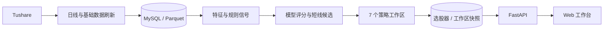
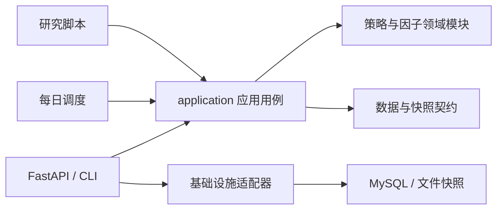
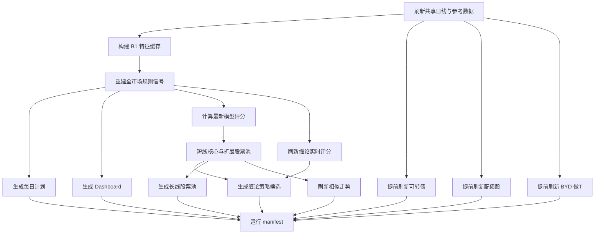

# 系统架构与数据流

## 目标

项目把量化工作拆为四个可独立维护的部分：数据接入、特征与策略计算、每日编排、Web 展示。研究脚本可以快速迭代，但进入每日生产链路的逻辑必须落在 `src/quant/`、配置文件和测试中。

## 组件关系



| 层 | 主要目录 | 责任 |
| --- | --- | --- |
| 数据 | `src/quant/data/` | Tushare 接入、字段标准化、MySQL/Parquet 读写 |
| 特征 | `src/quant/features/` | 市场情绪、项目变量和特征合并 |
| 策略 | `src/quant/strategies/` | 可复用的选股、交易和可转债规则 |
| 例行任务 | `src/quant/routine/` | 增量刷新、模型评分、工作区编排和 manifest |
| 应用 | `src/quant/application/`、`src/quant/webapp/`、`web/` | 应用用例、API、刷新状态和页面交互 |
| 基础设施 | `src/quant/infrastructure/` | 工作区快照文件/SQL 仓储等外部存储适配 |
| 研究 | `scripts/research/` | 训练、回测、参数迭代和审计，不直接作为 Web 服务入口 |

## 模块化单体边界

项目保持单进程可部署的模块化单体，不为七个工作区拆分独立微服务。新增代码遵循以下依赖方向：



- `src/quant/core/` 保存仓库路径和跨模块基础类型，不依赖应用、例行任务或 Web。
- `src/quant/application/` 保存 API、CLI 和调度共同调用的用例与契约，不导入 `quant.webapp` 或 `quant.routine`。
- `src/quant/infrastructure/` 封装文件系统和 SQL 等技术细节，通过工厂函数接收运行环境依赖。
- `src/quant/routine/` 只负责生产步骤和调度兼容入口，不导入 FastAPI/Web 服务。
- `src/quant/webapp/` 负责 HTTP 参数、错误映射、后台任务入口和静态页面挂载。
- `scripts/research/` 允许调用 `src/quant`，但 `src/quant` 不允许把研究脚本作为普通 Python 模块导入。
- 仍需兼容的研究命令必须集中在明确的任务适配层，逐批把计算实现迁入 `src/quant`，脚本最终只保留参数解析和结果打印。

架构边界由 `tests/test_architecture_boundaries.py` 使用 AST 扫描验证。

### 工作区垂直切片

`application/workspaces` 以“一个工作区一个用例模块”的方式逐步接管原先集中在
`webapp.services` 的计算流程：

- `byd.py` 负责 BYD 日线计划、行情标准化和快照回退。
- `convertible_bonds.py` 负责可转债网格计划、配债股质量评估和日缓存回退。
- 外部读取、写入、刷新和构建器均通过不可变依赖对象注入，应用层可以脱离 FastAPI 与真实存储测试。
- `webapp.services` 继续保留原公开函数和 monkeypatch 点，只负责构造依赖、兼容旧快照和映射 HTTP 调用。

后续迁移其他工作区时沿用同一模式，不在 `application` 内读取环境变量、实例化数据库连接或导入 Web 层。

### 前端模块与静态交付

- `web/core/api-client.js` 统一超时、取消、错误详情和 `no-store` API 请求。
- `web/core/formatters.js` 统一数值、百分比、金额、区间和 HTML 转义。
- `app.js` 保留页面编排与工作区交互，新增通用能力优先进入 `web/core/`。
- HTML 使用 `no-cache`，JS/CSS 使用 `Cache-Control: public, max-age=3600`；资源 URL 通过版本参数失效。
- FastAPI 对大于 1 KiB 的响应启用 gzip，并预加载两个前端 core 模块。

## 每日流水线

生产入口（与页面“更新全部”共用同一条执行路径）：

```bash
python scripts/run_daily_web_refresh.py
# 或 PYTHONPATH=src python -m quant.routine.cli web-refresh
```



并发边界：

- 行情刷新是所有计算的共享上游，必须先完成。
- 特征缓存与规则信号各自会创建 CPU 进程池，因此外层串行，避免 CPU、内存和磁盘争抢。
- 可转债、配债股和 BYD 做T 只依赖共享数据，数据就绪后立即三路并行，不等待短线计算。
- 特征与规则信号完成后，每日计划、Dashboard、模型评分和缠论实时评分四路并行；模型评分与缠论评分各自最多使用 4 个 worker。
- 核心与扩展股票池完成后，长线、缠论策略候选和相似走势三路并行，并与三个提前启动的工作区统一汇合。
- 长线工作区内部的 `tea`、`tea_safe`、`v44` 最多 3 路并行；三者共享一次加载到内存的月度行情和 `daily_basic`，生产刷新不落手工回测使用的大型中间缓存。
- 每个下游工作区独立记录结果；任一步骤失败会让全局任务失败，但已成功的提前任务会保留在检查点中供同日重试复用。

## Web 工作区

| 页面 Tab | API/服务入口 | 每日更新产物 |
| --- | --- | --- |
| 短线策略 | `/api/selector/stocks` | 模型分、核心/扩展候选和策略快照 |
| 缠论策略 | `/api/chan/strategy-plan` | 缠论模型候选快照 |
| 长线策略 | `/api/long/stock-pool` | 三种长线变体股票池 |
| 可转债策略 | `/api/convertible-bonds/plan` | 转债候选和网格计划 |
| 配债股 | `/api/convertible-bonds/allotments` | 发行流程、关键日期和配售数据 |
| BYD 做T | `/api/byd/daily-plan` | 日线区间计划与风险提示 |
| 相似走势 | `/api/similar-patterns/analysis` | 自选池相似案例和 T+1 情景 |

页面上的“更新全部”走后台刷新任务；单页按钮使用对应作用域或专用刷新接口。配债股和相似走势还会检查缓存日期，缓存不是当天时首次打开自动补刷。

## 存储与缓存

### 行情存储

`MarketDataStore` 由环境变量控制：

- 配置 `MARKET_DATA_SQL_URL` 时读写 MySQL。
- 日线只写统一表 `market_daily`，以 `(ts_code, trade_date)` 为唯一键批量 upsert，不再创建逐股票分表。
- `MARKET_DATA_MIRROR_PARQUET=1` 时同步更新年月分区 `data/raw/daily_partitioned/year_month=YYYYMM/data.parquet`，不再重写逐股票历史文件。
- 未配置 SQL URL 时，本地读取可回落到 Parquet。

### 应用快照

- 短线选股器快照按日期、策略组合和扩展标记区分。
- Web 工作区快照按工作区、日期和参数哈希区分，SQL 表为 `web_workspace_snapshots`。
- 工作区快照的日期回退、原子文件发布和 SQL 回退统一由 `WorkspaceSnapshotRepository` 处理；Web 层只组装路径和存储工厂。
- 配债股最新日缓存位于 `data/routine/convertible_bond_allotments_latest.json`。
- 相似走势自选池、分析和向量缓存位于 `data/research/similar_patterns/`。
- 后台刷新状态位于 `data/routine/latest_refresh_status.json`，服务重启后仍可读取最后状态。

### 缓存生命周期

- `data/raw/` 和 MySQL 行情表是正式数据，不按请求缓存规则删除。
- `data/cache/source_merge/tushare/` 是可重新拉取的请求级缓存：单股日线和已有正式 Parquet 副本的 `daily_basic` 只保留最近 7 天。
- `data/research/long_dividend_quality/` 是手工研究/回测中间缓存，只保留最近 2 组；生产长线股票池直接复用内存中的共享输入。
- 相似走势全市场历史参考向量最多每 7 天重建一次，只保留最新配置目录；自选池股票每天使用最新日线现场计算目标向量。
- smoke 向量缓存不属于生产数据，清理时全部删除。
- 每次完整刷新开始前执行统一清理；也可运行 `PYTHONPATH=src python -m quant.routine.cli cache-cleanup` 手工触发。

所有本地产物目录均由 `.gitignore` 排除。

## 关键设计约束

- 生产行情口径以 Tushare 为准；适配层只转换字段，不混用数据源。
- 每日任务应可重复执行；同日期产物采用覆盖、替换或稳定快照键，不做无界追加。
- Web 请求不应承担完整历史训练；训练和大规模回测留在研究脚本中。
- 策略配置、实现、测试和策略档案必须同步变更。
