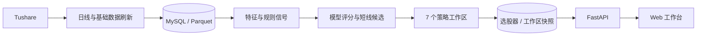
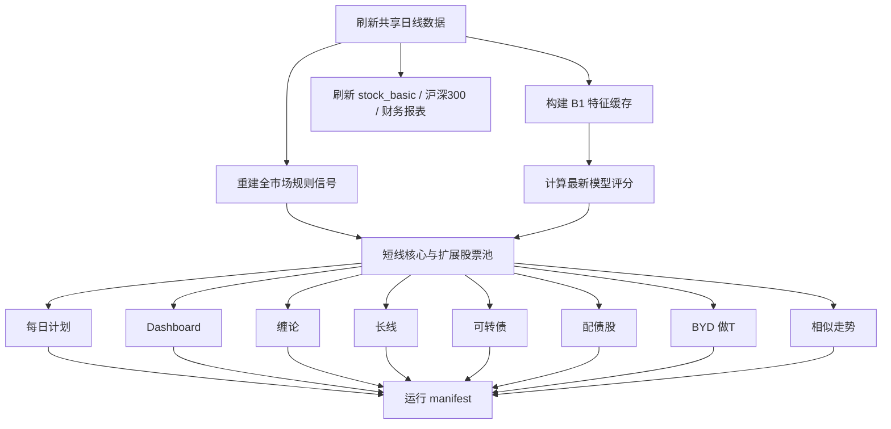

# 系统架构与数据流

## 目标

项目把量化工作拆为四个可独立维护的部分：数据接入、特征与策略计算、每日编排、Web 展示。研究脚本可以快速迭代，但进入每日生产链路的逻辑必须落在 `src/quant/`、配置文件和测试中。

## 组件关系



| 层 | 主要目录 | 责任 |
| --- | --- | --- |
| 数据 | `src/quant/data/` | Tushare 接入、字段标准化、MySQL/Parquet 读写 |
| 特征 | `src/quant/features/` | 市场情绪、项目变量和特征合并 |
| 策略 | `src/quant/strategies/` | 可复用的选股、交易和可转债规则 |
| 例行任务 | `src/quant/routine/` | 增量刷新、模型评分、工作区编排和 manifest |
| 应用 | `src/quant/webapp/`、`web/` | API、缓存、刷新状态和页面交互 |
| 研究 | `scripts/research/` | 训练、回测、参数迭代和审计，不直接作为 Web 服务入口 |

## 每日流水线

入口：

```bash
PYTHONPATH=src python -m quant.routine.cli daily --refresh-data --skip-backtest
```



并发边界：

- 行情刷新是所有计算的共享上游，必须先完成。
- 特征缓存与规则信号读取相同的日线数据，但写不同产物，可并行执行。
- 六个非短线工作区读取共享产物并写各自快照，默认最多 6 路并行。
- 长线工作区内部的 `tea`、`tea_safe`、`v44` 最多 3 路并行；三者共享一次加载到内存的月度行情和 `daily_basic`，生产刷新不落手工回测使用的大型中间缓存。
- 每个下游工作区独立记录成功或失败；失败不会取消已经运行的其他工作区。

## Web 工作区

| 页面 Tab | API/服务入口 | 每日更新产物 |
| --- | --- | --- |
| 短线策略 | `/api/selector/stocks` | 模型分、核心/扩展候选和策略快照 |
| 缠论策略 | `/api/chan/strategy-plan` | 缠论模型候选快照 |
| 长线策略 | `/api/long/stock-pool` | 三种长线变体股票池 |
| 可转债策略 | `/api/convertible-bonds/plan` | 转债候选和网格计划 |
| 配债股 | `/api/convertible-bonds/allotments` | 发行流程、关键日期和配售数据 |
| BYD 做T | `/api/byd/daily-plan` | 日线区间计划与风险提示 |
| 相似走势 | `/api/similar-patterns/analysis` | 自选池相似案例和 T+1 情景 |

页面上的“更新全部”走后台刷新任务；单页按钮使用对应作用域或专用刷新接口。配债股和相似走势还会检查缓存日期，缓存不是当天时首次打开自动补刷。

## 存储与缓存

### 行情存储

`MarketDataStore` 由环境变量控制：

- 配置 `MARKET_DATA_SQL_URL` 时读写 MySQL。
- 日线只写统一表 `market_daily`，以 `(ts_code, trade_date)` 为唯一键批量 upsert，不再创建逐股票分表。
- `MARKET_DATA_MIRROR_PARQUET=1` 时同步更新年月分区 `data/raw/daily_partitioned/year_month=YYYYMM/data.parquet`，不再重写逐股票历史文件。
- 未配置 SQL URL 时，本地读取可回落到 Parquet。

### 应用快照

- 短线选股器快照按日期、策略组合和扩展标记区分。
- Web 工作区快照按工作区、日期和参数哈希区分，SQL 表为 `web_workspace_snapshots`。
- 配债股最新日缓存位于 `data/routine/convertible_bond_allotments_latest.json`。
- 相似走势自选池、分析和向量缓存位于 `data/research/similar_patterns/`。
- 后台刷新状态位于 `data/routine/latest_refresh_status.json`，服务重启后仍可读取最后状态。

### 缓存生命周期

- `data/raw/` 和 MySQL 行情表是正式数据，不按请求缓存规则删除。
- `data/cache/source_merge/tushare/` 是可重新拉取的请求级缓存：单股日线和已有正式 Parquet 副本的 `daily_basic` 只保留最近 7 天。
- `data/research/long_dividend_quality/` 是手工研究/回测中间缓存，只保留最近 2 组；生产长线股票池直接复用内存中的共享输入。
- 相似走势全市场历史参考向量最多每 7 天重建一次，只保留最新配置目录；自选池股票每天使用最新日线现场计算目标向量。
- smoke 向量缓存不属于生产数据，清理时全部删除。
- 每次完整刷新开始前执行统一清理；也可运行 `PYTHONPATH=src python -m quant.routine.cli cache-cleanup` 手工触发。

所有本地产物目录均由 `.gitignore` 排除。

## 关键设计约束

- 生产行情口径以 Tushare 为准；适配层只转换字段，不混用数据源。
- 每日任务应可重复执行；同日期产物采用覆盖、替换或稳定快照键，不做无界追加。
- Web 请求不应承担完整历史训练；训练和大规模回测留在研究脚本中。
- 策略配置、实现、测试和策略档案必须同步变更。
